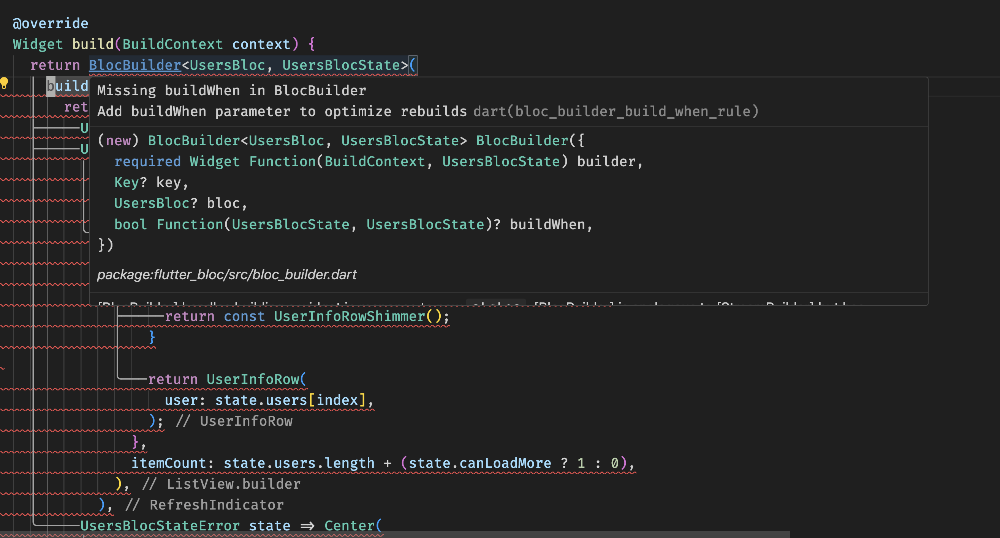
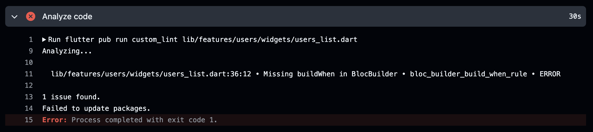

# Пишем кастомные правила линтера для Dart и Flutter-проектов

[Стандартный набор правил линтера Dart'а](https://dart.dev/tools/linter-rules) содержит много готовых проверок кода,
которые помогают нам выявлять потенциальные ошибки и проблемы в проекте.

Однако, иногда приходится писать собственные правила для линтера.

**Вот несколько причин, почему нам могут потребоваться свои проверки кода:**

- *Единые стандарты:* обеспечение согласованности в больших командах.
- *Обнаружение специфических проблем:* бизнес-логика или особенности архитектуры проекта могут содержать логику,
  работоспособность которой лучше доверить машине.
- *Сокращение Code Review:* ваш код уже прошел минимальный набор обязательных проверок, и ревьюеру будет проще
  сконцентрироваться на бизнес-части, нежели писать кучу однотипных комментариев с просьбами добавить или убрать что-то
  из проекта.
- *Документирование:* кастомные правила порой говорят сами за себя. Вам не нужно читать кучу документации перед началом
  работы над проектом, многое будет подсвечено в процессе.

Dart имеет свой фреймворк для создания подобных решений, и называется
он [analyzer_plugin](https://pub.dev/packages/analyzer_plugin). К сожалению, сейчас он недоступен для общего
иcпользования, и в целом разработка на нем требует больше подготовительных моментов, нежели другие решения.

Мы будем использовать [custom_lint](https://pub.dev/packages/custom_lint). Это стороннее решение для создания
собственных правил линтера. Плагин поддерживается сообществом, содержит рабочие примеры кода, а также дает возможность
запускать свои правила отдельно из CLI.

## Что будем проверять?

Возьмем как пример реальный кейс, который может иногда встречаться в Flutter-проектах. Будем разбирать его в
рамках постепенного улучшения [bloc_example](https://github.com/fluttermiddlepodcast/bloc_example). Это небольшой
проект, где мы изучаем [flutter_bloc](https://pub.dev/packages/flutter_bloc).

*Цель: нужно правило для проверки всех виджетов `BlocBuilder` на наличие параметра `buildWhen`. Это аргумент, который
позволяет определить, нужно ли обновлять UI при изменении состояния, тем самым минимизируя лишние перерисовки во
время ненужных обновлений. Если вы не работали с `flutter_bloc`, то начать
можно [отсюда](https://github.com/fluttermiddlepodcast/bloc_example). В репозитории есть ссылки на видео-материалы и
выпуски подкаста, а также [обзор `BlocBuilder`](https://youtu.be/98iF13KKdss).*

**Опираясь на код, вот так неправильно:**

```dart
@override
Widget build(BuildContext context) {
  return BlocBuilder<AuthBloc, AuthState>(
    // Тут должен быть параметр `buildWhen`, но его нет.
    builder: (context, state) {
      return state.isAuthenticated ? HomePage() : LoginPage();
    },
  );
}
```

**А вот так правильно:**

```dart
@override
Widget build(BuildContext context) {
  return BlocBuilder<AuthBloc, AuthState>(
    buildWhen: (previous, current) {
      return previous.isAuthenticated != current.isAuthenticated;
    },
    builder: (context, state) {
      return state.isAuthenticated ? HomePage() : LoginPage();
    },
  );
}
```

Если параметр `buildWhen` не указан, то мы увидим ошибку в IDE, либо во время прогона CI.

**IDE покажет такой вывод:**



**CI или консоль выдаст следующее:**



## Реализация правила

**В проекте имеем всего два файла:**

- [./lib/bloc_builder_build_when_lint_rule.dart](./lib/bloc_builder_build_when_lint_rule.dart) - код с конфигурацией
  нашего плагина.
- [./lib/src/bloc_builder_build_when_rule.dart](./lib/src/bloc_builder_build_when_rule.dart) - код с логикой нашего
  правила.

### Код правила

[./lib/src/bloc_builder_build_when_rule.dart](./lib/src/bloc_builder_build_when_rule.dart)

**Полный листинг с кода правила c комментариями:**

```dart
import 'package:analyzer/dart/ast/ast.dart';
import 'package:analyzer/error/error.dart' show ErrorSeverity;
import 'package:analyzer/error/listener.dart';
import 'package:custom_lint_builder/custom_lint_builder.dart';

// Класс с логикой нашего правила.
// Наследуемся от DartLintRule - класса из плагина custom_lint.
// DartLintRule содержит в себе набор методов, которые помогут нам в написании правила линтера.
class BlocBuilderBuildWhenRule extends DartLintRule {
  BlocBuilderBuildWhenRule()
      : super(
    // LintCode - описание нашего правила.
    // Данные из него будут браться для отображения информации об ошибке или предупреждении в IDE / CLI.
    code: LintCode(
      // Название правила.
      // Можете брать примеры именований из https://dart.dev/tools/linter-rules#rules.
      name: 'bloc_builder_build_when_rule',
      // Описание проблемы.
      problemMessage: 'Missing buildWhen in BlocBuilder',
      // Описание того, что нужно сделать для исправления ошибки.
      correctionMessage: 'Add buildWhen parameter to optimize rebuilds',
      // Серьезность проблемы.
      // Обычно для правил линтера используется либо WARNING, либо ERROR.
      // `WARNING` - предупреждение о проблемном месте в коде. Может влиять на работу приложения, но не сильно критично, чтобы делать правило ошибкой.
      // `ERROR` - ошибка, без которой лучше не собирать проект. Нужно править как только она появилась.
      // Есть и другие виды серьезности для правил, можете посмотреть их в документации.
      // P.S: с ошибками линтера можно собирать приложение, если они не влияют на процесс билда. Но, раз они есть, лучше поправить, либо же вообще отключить, раз есть кейсы, когда их можно игнорировать.
      errorSeverity: ErrorSeverity.ERROR,
    ),
  );

  // Основной метод, где происходит анализ кода.
  @override
  void run(CustomLintResolver resolver,
      ErrorReporter reporter,
      CustomLintContext context,) {
    // Региструем обработчик кода.
    // В нашем случае используем `addInstanceCreationExpression`, так как нужно проверять создание `BlocBuilder` в проекте. А это как раз то место, где создается инстанс.
    context.registry.addInstanceCreationExpression(
            (node) {
          // Для начала, нужно проверить тип объекта, который поступает на проверку.
          // В `addInstanceCreationExpression` будут попадать все созданные инстансы в проекте, а нам нужен только `BlocBuilder`.
          final type = node.constructorName.type;

          // Проверяем тип класса и его пакет.
          // `BlocBuilder` может быть реализован не только в пакете `flutter_bloc`, и мы не знаем, что там может быть.
          if (!_isType(type, 'BlocBuilder', 'flutter_bloc')) {
            return;
          }

          // После прохождения всех проверок, мы точно знаем, что перед нами инстанс `BlocBuilder` из `flutter_bloc`.
          // Теперь осталось только проверить наличие параметра `buildWhen`.
          final hasBuildWhen = node.argumentList.arguments.any(
                (arg) => arg is NamedExpression && arg.name.label.name == 'buildWhen',
          );

          // Если параметр `buildWhen` отсутствует у проверяемого нами `BlocBuilder`, подсвечиваем ошибку.
          if (!hasBuildWhen) {
            // В репортера передаем:
            // `node` - место в коде, где расположена ошибка.
            // `code` - описание ошибки.
            reporter.atNode(node, code);
          }
        }
    );
  }

  // Проверка типа по заданным параметрам.
  // Так же проверяем и пакет типа, чтобы исключить возможные коллизии.
  bool _isType(TypeAnnotation? type,
      String matchType,
      String package,) {
    // Для проверки всех нужных нам полей, для начала получим элемент кода.
    final element = type?.type?.element;

    // Если элемента нет, или его имя (название класса) не соответствуют нашим требованиями, возвращаем `false` и прекращаем исследование этой части кода.
    if (element == null || element.name != matchType) {
      return false;
    }

    // После проверки наличия элемента и его названия, проверяем пакет на соответствие тому, что передан в аргументе метода.
    return element.library?.location?.components.any((c) => c.contains(package)) ?? false;
  }
}
```

### Конфигурация плагина

[./lib/bloc_builder_build_when_lint_rule.dart](./lib/bloc_builder_build_when_lint_rule.dart)

**Содержимое файла с комментариями:**

```dart
import 'package:bloc_builder_build_when_lint_rule/src/bloc_builder_build_when_rule.dart';
import 'package:custom_lint_builder/custom_lint_builder.dart';

// Главная функция-фабрика для создания плагина.
// Важно:
// - Должна называться именно `createPlugin`;
// - Возвращает обязательно экземпляр плагина, реализующий PluginBase.
PluginBase createPlugin() => _BlocBuilderLintPlugin();

// Наш плагин с кастомными правилами.
class _BlocBuilderLintPlugin extends PluginBase {
  // Переопределяем метод, который возвращает список правил.
  @override
  List<LintRule> getLintRules(CustomLintConfigs configs) =>
      [
        // Создаем и возвращаем экземпляр нашего правила.
        // Самих правил может быть сколько вам угодно.
        // Порядок не имеет значения.
        BlocBuilderBuildWhenRule(),
      ];
}
```

## Запуск

Рассмотрим как локальный запуск - работу с IDE, так и конфигурацию для CI.

### Локально

После создания правила нужно добавить его в ваш проект. Поскольку мы зависим от `custom_lint`, его так же нужно
добавить в `dev_dependencies`. Готовый файл можно найти [тут](./pubspec.yaml).

**Из Git-репозитория добавление будет таким:**

```yaml
dev_dependencies:
  custom_lint:
  bloc_builder_build_when_rule:
    git:
      url: https://github.com/fluttermiddlepodcast/bloc_builder_build_when_lint_rule.git
      ref: master
```

**Если плагин расположен локально, то можно просто указать относительный путь от проекта до правила:**

```yaml
dev_dependencies:
  custom_lint:
  bloc_builder_build_when_rule:
    path: ../bloc_builder_build_when_lint_rule
```

**Далее запускаем `dart pub get` для загрузки зависимостей и подключения их в проект:**

```shell
$ dart pub get
```

После анализа проекта плагин будет доступен в проекте. Если у вас есть какие-то виджеты типа `BlocBuilder` без
указанного `buildWhen`, IDE начнет подсвечивать их инициализацию с
ошибкой. [Ветка bloc_example с нашим правилом](https://github.com/fluttermiddlepodcast/bloc_example/tree/custom_lint)
содержит невалидный по меркам правила код, можете выгрузить и убедиться в работоспособности плагина.

**Для запуска всех проверок `custom_lint`, достаточно выполнить из терминала:**

```shell
$ dart pub run custom_lint
```

### CI

Конфигурацию для GitHub Actions можно
найти [тут](https://github.com/fluttermiddlepodcast/bloc_example/blob/custom_lint/.github/workflows/flutter.yaml). Если
вам интересно, что там дополнительно навешано для оптимизации запуска CI, и как еще можно ускорить ваши проверки,
рекомендую посмотреть [отдельное видео](https://youtu.be/NxY6mGaIzKY) по этой теме.

**Сама часть с `custom_lint` будет выглядеть следующим образом:**

```yaml
custom_lint:
  runs-on: ubuntu-latest
  needs: changes
  if: needs.changes.outputs.any_changed == 'true'
  steps:
    - uses: actions/checkout@v4
    - uses: kuhnroyal/flutter-fvm-config-action@v2
      id: fvm-config-action
    - uses: subosito/flutter-action@v2
      with:
        flutter-version: ${{ steps.fvm-config-action.outputs.FLUTTER_VERSION }}
        channel: ${{ steps.fvm-config-action.outputs.FLUTTER_CHANNEL }}
    - name: Get dependencies
      run: flutter pub get
    - name: Analyze code
      run: flutter pub run custom_lint ${{ needs.changes.outputs.all_changed_files }}
```

Упавший билд CI можно посмотреть [в этом пулл реквесте](https://github.com/fluttermiddlepodcast/bloc_example/pull/12).

## Подводные камни

Если бы с написанием правил для линтера было все так просто, много проблемных моментов на проектах удалось бы избежать в
процессе его написания и рефакторинга.

**К сожалению, мы имеем следующие минусы:**

- *Сложность освоения:* если небольшие правила можно написать без дополнительной подготовки с каким-нибудь
  AI-ассистентом,
  то со сложными решениями придется повозиться. Понадобится изучить
  [Dart AST](https://ru.wikipedia.org/wiki/%D0%90%D0%B1%D1%81%D1%82%D1%80%D0%B0%D0%BA%D1%82%D0%BD%D0%BE%D0%B5_%D1%81%D0%B8%D0%BD%D1%82%D0%B0%D0%BA%D1%81%D0%B8%D1%87%D0%B5%D1%81%D0%BA%D0%BE%D0%B5_%D0%B4%D0%B5%D1%80%D0%B5%D0%B2%D0%BE)
  и работу аналайзера кода в целом.
- *Возможные ложные срабатывания:* есть риск что-то упустить во время написания сложной логики обработки кода. Из-за
  этого проверки могут реагировать на валидный код, который, например, написан правильно, но не так, как ожидалось.
- *Поддержка и обновление:* Dart, Flutter и сторонние плагины обновляются, и нужно следить за тем, насколько ваши
  правила актуальны для используемых инструментов.
- *Производительность:* сложные проверки или неоптимизированные правила могут замедлить работу Аналайзера даже на
  не самых больших проектах. Потребуется дополнительное время на написание более оптимального подхода по анализу
  кода.
- *Overengineering:* есть риск создания бесполезных правил ради правил. Вкупе с минусами выше становится одной из
  главных проблем - ненужное неоптимизированное правило будет тормозить разработку. Порой такие решения могут жить в
  проекте годами, и их не будут убирать чисто из-за незнания того, сломается что-то или нет. Лучше заранее подумать,
  насколько +1 анализатор кода вам действительно нужен.

## Выводы

Пример из проекта - лишь капля в море возможностей реализации проверок вашего кода. Писать собственные правила не так
трудно, нужно лишь время на разбор концепций и написание инструментов.

Импакт от таких решений на больших проектах можно оценить в уменьшении времени проверки кода коллег, следовании
регламентам компании и в целом снижением количества споров и потенциально глупых ошибок.
